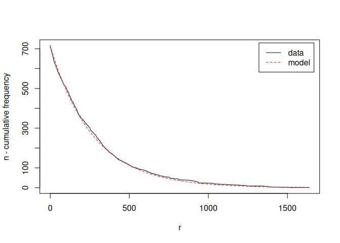

#  R package arulesNBMiner - Mining NB-Frequent Itemsets and NB-Precise Rules

[](https://CRAN.R-project.org/package=arulesNBMiner)
[](https://CRAN.R-project.org/package=arulesNBMiner)
 [](https://mhahsler.r-universe.dev/arulesNBMiner)

**Maintainer:** [Michael Hahsler](https://michael.hahsler.net)

This R package extends [`arules`](https://michael.hahsler.net/arules/)
with NBMiner, an implementation of the model-based mining algorithm for
NB-frequent itemsets described in Michael Hahsler’s paper, [“A
model-based frequency constraint for mining associations from
transaction data.”](https://dx.doi.org/10.1007/s10618-005-0026-2) *Data
Mining and Knowledge Discovery,* 13(2):137-166, September 2006.

This algorithm dynamically chooses support for itemsets based on the
deviation from a fitted independence model. NBMiner is better at
suppressing spurious patters and finds interesting patterns with lower
support compared to the traditional minimum support-based algorithms.

## Installation

**Stable CRAN version:** Install from within R with

``` r
install.packages("arulesNBMiner")
```

**Current development version:** Install from
[r-universe.](https://mhahsler.r-universe.dev/arulesNBMiner)

``` r
install.packages("arulesNBMiner",
    repos = c("https://mhahsler.r-universe.dev",
              "https://cloud.r-project.org/"))
```

## Usage

Estimate negative binomial distribution (NBD) model parameters for the
arules Groceries data set.

``` r
library("arulesNBMiner")
data("Groceries")

param <- NBMinerParameters(Groceries, trim = 0.1)
```

    ## 17 item(s) trimmed, leaving  152  items. 
    ## using Expectation Maximization for missing zero class
    ## iteration = 1 , zero class = 2 , k = 0.86 , m = 153 
    ## total items =  154 
    ## 
    ## Goodness of fit/chi-square test on binned count data
    ##   H0: Observed counts match the expected proportions.
    ##   Bins:  10 
    ##   X-squared =  6.6  with  9  degrees of freedom
    ##   p.value =  0.68

<!-- --> Note that the model
shows independence but the dataset contains a significant amount of
correlated items shown by the larger cumulative frequency.

Mine NB-frequent itemsets

``` r
itemsets_NB <- NBMiner(Groceries, parameter = param, minlen = 2L)
itemsets_NB
```

    ## set of 2881 itemsets

Add support and inspect some NB-frequent itemsets with the highest
precision.

``` r
quality(itemsets_NB) <- cbind(quality(itemsets_NB), support = interestMeasure(itemsets_NB,
    "support", transactions = Groceries))

inspect(head(itemsets_NB, by = "precision"))
```

    ##     items                                        precision support
    ## [1] {bottled beer, liquor, red/blush wine}       1         0.00193
    ## [2] {bottled beer, liquor}                       1         0.00468
    ## [3] {soda, bottled beer, liquor, red/blush wine} 1         0.00081
    ## [4] {whole milk, curd}                           1         0.02613
    ## [5] {whole milk, rolls/buns, margarine}          1         0.00793
    ## [6] {whole milk, butter}                         1         0.02755

A precision close to 1 means that there is very little chance that they
are spurious. We see that some very low support itemsets are under the
top NB-frequent itemsets.

## References

- Michael Hahsler, [A model-based frequency constraint for mining
  associations from transaction
  data.](https://dx.doi.org/10.1007/s10618-005-0026-2) *Data Mining and
  Knowledge Discovery,* 13(2):137-166, September 2006. [Preprint on
  ArXiv](https://doi.org/10.48550/arXiv.0803.3224)
- Michael Hahsler, Sudheer Chelluboina, Kurt Hornik, and Christian
  Buchta. [The arules R-package ecosystem: Analyzing interesting
  patterns from large transaction
  datasets.](https://jmlr.csail.mit.edu/papers/v12/hahsler11a.html)
  *Journal of Machine Learning Research,* 12:1977-1981, 2011.
