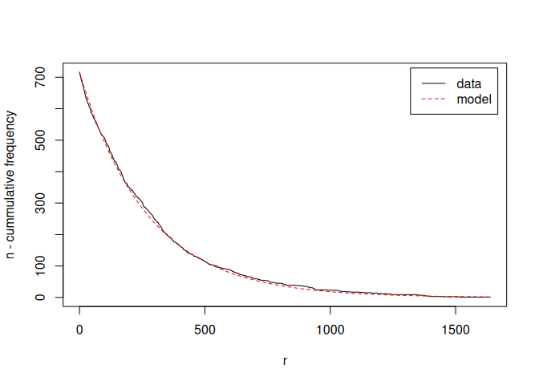

#  R package stream - Infrastructure for Data Stream Mining

[](https://CRAN.R-project.org/package=stream)
[](https://mhahsler.r-universe.dev/ui#package:stream)
[](https://CRAN.R-project.org/package=stream)

This R package extends package
[arules](https://github.com/mhahsler/arules) with NBMiner, an
implementation of the model-based mining algorithm for mining
NB-frequent itemsets presented in “Michael Hahsler. [A model-based
frequency constraint for mining associations from transaction
data.](https://dx.doi.org/10.1007/s10618-005-0026-2) *Data Mining and
Knowledge Discovery,* 13(2):137-166, September 2006.” In addition an
extension for NB-precise rules is implemented.

## Installation

**Stable CRAN version:** Install from within R with

``` r
install.packages("stream")
```

**Current development version:** Install from
[r-universe.](https://mhahsler.r-universe.dev/ui#package:stream)

``` r
install.packages("stream", repos = "https://mhahsler.r-universe.dev")
```

## Usage

Estimate NBD model parameters for the Agrawal data set.

``` r
library(arulesNBMiner)
data("Agrawal")

param <- NBMinerParameters(Agrawal.db, pi = 0.99, theta = 0.5, maxlen = 5, minlen = 1,
    trim = 0, verb = TRUE, plot = TRUE)
```

    ## using Expectation Maximization for missing zero class
    ## iteration = 1 , zero class = 3 , k = 0.99 , m = 278 
    ## iteration = 2 , zero class = 3 , k = 0.99 , m = 278 
    ## total items =  719

<!-- -->

Mine NB-frequent itemsets

``` r
itemsets_NB <- NBMiner(Agrawal.db, parameter = param, control = list(verb = TRUE,
    debug = FALSE))
```

    ## 
    ## parameter specification:
    ##    pi theta   n    k      a minlen maxlen rules
    ##  0.99   0.5 719 0.99 0.0014      1      5 FALSE
    ## 
    ## algorithmic control:
    ##  verbose debug
    ##     TRUE FALSE

Inspect some itemsets with the highest precision.

``` r
inspect(head(itemsets_NB, by = "precision"))
```

    ##     items                                        precision
    ## [1] {item220, item956, item964}                  1        
    ## [2] {item510, item667, item885}                  1        
    ## [3] {item452, item956, item964}                  1        
    ## [4] {item60, item173, item417, item440, item831} 1        
    ## [5] {item258, item452, item956}                  1        
    ## [6] {item149, item231, item611}                  1

## References

-   Michael Hahsler, [A model-based frequency constraint for mining
    associations from transaction
    data.](https://dx.doi.org/10.1007/s10618-005-0026-2) *Data Mining
    and Knowledge Discovery,* 13(2):137-166, September 2006. [Free
    preprint](https://michael.hahsler.net/research/nbd_dami2005/nbd_associationrules_dami2005.pdf)
-   Michael Hahsler, Sudheer Chelluboina, Kurt Hornik, and Christian
    Buchta. [The arules R-package ecosystem: Analyzing interesting
    patterns from large transaction
    datasets.](https://jmlr.csail.mit.edu/papers/v12/hahsler11a.html)
    *Journal of Machine Learning Research,* 12:1977-1981, 2011.
