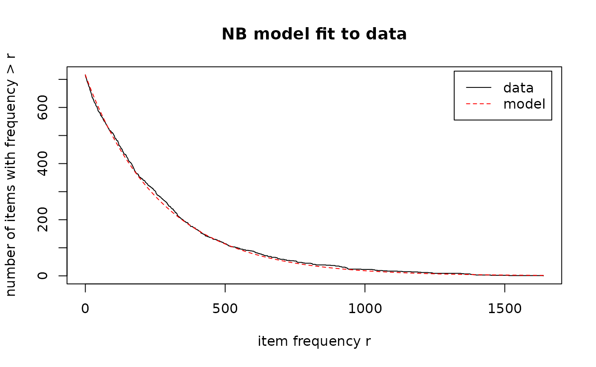

# Getting started with arulesNBMiner

Association rule mining using the support-confidence framework is
plagued by the issue that it produces a large amount of spurious
frequent itemsets and rules while still ignoring patterns that are below
the set minimum support threshold.

This issue is addressed by `arulesNBMiner`, which extends the `arules`
package with the NBMiner algorithm to mine NB-frequent itemsets and
NB-precise association rules. The algorithm uses a model-based frequency
constraint as an alternative to a single, user-specified minimum
support. The constraint utilizes knowledge of the process generating
transaction data by applying a simple stochastic mixture model (the NB
model) which allows for transaction data’s typically highly skewed item
frequency distribution.

A user-specified precision threshold is used together with the model to
find local frequency thresholds for groups of itemsets. Based on the
constraint we develop the notion of NB-frequent itemsets and adapt a
mining algorithm to find all NB-frequent itemsets in a database.
Experiments in Hahsler (2006) show that the new constraint provides
improvements over a single minimum support threshold and that the
precision threshold is more robust and easier to set and interpret by
the user.

This vignette demonstrates the workflow with the package’s bundled
Agrawal transactions This dataset is artificially created from a known
set of patterns, which we will use to evaluate how well the algorithm is
able to recover them.

## Load the data

Load the package and its example data. `Agrawal.db` is a `transactions`
object, the input format used by `arulesNBMiner`.

``` r

library(arulesNBMiner)
#> Loading required package: arules
#> Loading required package: Matrix
#> 
#> Attaching package: 'arules'
#> The following objects are masked from 'package:base':
#> 
#>     abbreviate, write
#> Loading required package: rJava
data("Agrawal")
Agrawal.db
#> transactions in sparse format with
#>  20000 transactions (rows) and
#>  1000 items (columns)
```

The dataset was created using 2000 patterns (itemsets) as described in
`Agrawal.db`. Patterns are mixed and corrupted to create the
transactions.

``` r

Agrawal.pat
#> set of 2000 itemsets
```

## Fit the baseline model

NBMiner uses a stochastic baseline model for independent items. Each
item’s frequency is modeled as a Poisson count with an item specific
rate. The variation in those rates over items is modeled by a Gamma
distribution. Mixing the Poisson counts over the Gamma rates gives a
negative binomial distribution. This flexible baseline captures the
skewed frequency distributions common in transaction data: a few items
occur often, while many occur rarely.

[`NBMinerParameters()`](https://michael.hahsler.net/arulesNBMiner/reference/NBMinerParameters.md)
estimates this global model from the item frequencies. Items that never
occur are absent from the transactions, so the estimator uses an
expectation-maximization procedure to estimate the unobserved zero
frequency class. The `trim` argument can exclude the most frequent items
when they are outliers that would distort the fit. Inspect the
diagnostic plot before choosing a nonzero trim value. A suitable trim
percentage can be found by visual comparison of the empirical data and
the estimated model or by minimizing the \\\chi^2\\-value of the
goodness-of-fit test reported during the fit procedure.

``` r

param <- NBMinerParameters(Agrawal.db, trim = 0)
#> using Expectation Maximization for missing zero class
#> iteration = 1 , zero class = 3 , k = 0.9862909 , m = 277.9777 
#> iteration = 2 , zero class = 3 , k = 0.9862909 , m = 277.9777 
#> total items =  719 
#> 
#> Goodness of fit/chi-square test on binned count data
#>   H0: Observed counts match the expected proportions.
#>   Bins:  10 
#>   X-squared =  5.778414  with  9  degrees of freedom
#>   p.value =  0.7618744
```



``` r

param
#>    pi theta   n         k           a minlen maxlen rules
#>  0.99   0.5 719 0.9862909 0.001371754      1      5 FALSE
```

The diagnostic plot compares the observed data with the model. The plot
shows the number of items with a frequency larger than . The fitted
distribution is characterized by the two parameters of the
negative-binomial distribution, the scaling parameter \\a\\ and the
shape parameter \\k\\.

## Mine NB-frequent itemsets

The NB distribution provides for an itemset \\l\\ a baseline for the
support distribution of the candidate 1-extension itemsets \\l \cup
\\c\\\\ under independence. If in the database some item candidates
\\c\\ are related to the items in \\l\\, then \\l \cup \\c\\\\ will have
a higher frequency in the data than expected by the baseline model.
Finding non-random 1-extensions of \\l\\ (extensions with item
candidates with a too high co-occurrence frequency), is the same as
identifying a frequency threshold \\\sigma_l\\, where accepting item
candidates with a frequency count \\r \ge \sigma_l\\ separates
associated items best from items which co-occur often by pure chance. We
use a threshold on precision \\\pi\\, the proportion of correctly
predicted positive cases in all predicted positive cases to determine
\\\sigma_l\\ and accept all 1-extensions \\l \cup \\c\\\\ if

\\supp(l \cup \\c\\) ≥ \sigma_l\\.

This means that the single user-specified precision threshold \\\pi\\
leads to different support thresholds \\\sigma_l\\, one for all
1-extensions of itemset \\l\\.

The `pi` parameter sets the minimum predicted precision for accepting
1-extensions.

The `theta` parameter controls pruning during search. For a larger
itemset, it sets the required fraction of its immediate subsets that
must support the itemset as an NB-frequent pattern. A value of 1 is most
restrictive requiring all subsets also to be NB-frequent; 0 relaxes this
condition. The intermediate default value 0.5 balances pruning with the
chance of retaining associations whose items have different frequencies.

``` r

itemsets_NB <- NBMiner(Agrawal.db, 
                       pi = 0.99,
                       parameter = param, 
                       minlen = 2L)
itemsets_NB
#> set of 2603 itemsets
```

``` r

inspect(head(itemsets_NB, by = "precision"))
#>     items                                        precision
#> [1] {item220, item956, item964}                  1        
#> [2] {item510, item667, item885}                  1        
#> [3] {item452, item956, item964}                  1        
#> [4] {item60, item173, item417, item440, item831} 1        
#> [5] {item258, item452, item956}                  1        
#> [6] {item149, item231, item611}                  1
```

## NB-frequent vs. frequent itemsets?

How many found itemsets are non-spurious, meaning that they are
consistent with the known patterns used to generate the data? This can
be answered by looking of how many found patterns contain only items
which are subsets of the items in the patterns.

``` r

num_correct <- function(itemsets, patterns)
    table(factor(rowSums(is.subset(itemsets, patterns)) > 0,
          c(FALSE, TRUE)))

num_correct(itemsets_NB, Agrawal.pat)
#> 
#> FALSE  TRUE 
#>     0  2603
```

Now compare this with the non-spurious patterns found by regular
frequent itemset mining. We use here the Apriori algorithm and select
the same number of itemsets with the highest support.

``` r

itemsets_supp <-  apriori(Agrawal.db, 
                          support = 0.001, 
                          target = "frequent", 
                          minlen = 2,
                          control = list(verbose = FALSE))
itemsets_supp <- head(sort(itemsets_supp, by = "support"), length(itemsets_NB))
itemsets_supp
#> set of 2603 itemsets

num_correct(itemsets_supp, Agrawal.pat)
#> 
#> FALSE  TRUE 
#>   692  1911
```

NB-frequent itemsets are much better at finding non-spurious itemsets.
Since NBMiner sets individual support thresholds for itemsets, it is
also able to accept less frequent itemsets which are removed by the
strict minimum support used for regular frequent itemsets.

``` r

support_dist <- data.frame("NB-frequent" = support(itemsets_NB, transactions = Agrawal.db), 
                 "frequent" = support(itemsets_supp, transactions = Agrawal.db))

boxplot(support_dist, horizontal = TRUE)
```


NB-frequent itemsets are useful when it is important to find itemsets
with low support and when suppressing spurious itemsets is important.

## Mine NB-precise rules

Hahsler (2006) shows an important connection between 1-extensions and
association rules:

\\supp(l \cup \\c\\) \ge \sigma_l \iff conf(l \rightarrow c) \ge
\gamma_l\\ This means choosing \\\sigma_l\\ on 1-extensions is
equivalent to choosing a confidence threshold \\\gamma_l\\ for all rules
starting with \\l\\. We call these rules NB-precise rules since the
individual confidence thresholds are chosen using a user-specified
precision threshold \\\pi\\.

NB-precise rules are rules created by NBMiner with the parameter
`rules = TRUE`.

For comparison, we add the standard measures support, confidence, and
lift.

``` r

rules <- NBMiner(Agrawal.db, 
                 parameter = param,
                 pi = 0.99,
                 rules = TRUE)
rules
#> set of 5617 rules
```

``` r

quality(rules) <- cbind(quality(rules),
                        interestMeasure(rules, 
                                        c("support", "confidence", "lift"), 
                                        transactions = Agrawal.db))

inspect(head(sort(rules, by = "precision"), n = 10))
#>      lhs                   rhs       precision support confidence lift    
#> [1]  {item220, item964} => {item956} 1         0.01100 0.9649123  75.67939
#> [2]  {item220, item452} => {item956} 1         0.01155 0.9625000  75.49020
#> [3]  {item510, item885} => {item667} 1         0.01180 0.8773234  26.82946
#> [4]  {item452, item964} => {item956} 1         0.01115 0.9695652  76.04433
#> [5]  {item889}          => {item860} 1         0.00990 0.8839286  37.21805
#> [6]  {item848}          => {item152} 1         0.00775 0.6126482  10.50855
#> [7]  {item167, item552} => {item959} 1         0.01215 0.9310345  24.59800
#> [8]  {item987}          => {item320} 1         0.00960 0.8170213  17.83889
#> [9]  {item529, item627} => {item940} 1         0.01075 0.9071730  26.10570
#> [10] {item707}          => {item394} 1         0.00865 0.8046512  19.48308
```

Rules found with a precision close to 1 are very unlikely to be
spurious. Bu comparing the rules to standard association rule interest
measures, we see that these some rules have significantly smaller
support but all have very large lift values.

## References

Hahsler, M. (2006). [A model-based frequency constraint for mining
associations from transaction
data](https://doi.org/10.1007/s10618-005-0026-2). *Data Mining and
Knowledge Discovery*, 13(2), 137–166. [Full text on
arXiv](https://arxiv.org/pdf/0803.3224).
